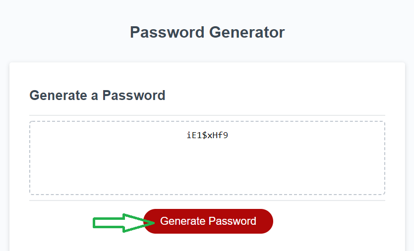

# password-generator

Just check into the code for password generation.

- After launching website, click on Generate Password button.
- Provide input of length of password you want to generate.
- Validates the length of user input. Minimum characters should be 8 and maximum can go upto 128 characters 
- Answer few questions on type of characters to be selected for generating password.
- Choices of character could be lower-case, upper-case, numbers, special characters.
- Validates and add atleast one of each type of selected characters.
- Generates final password of your choice as per the given length and type of characters. Find below the screenshot of the application :




## Prerequisites

```
git clone https://github.com/shambhawi13/password-generator.git
```

## Technologies Used
- HTML - used to create elements on the DOM
- CSS - styles html elements on page
- Git - version control system to track changes to source code
- GitHub - hosts repository that can be deployed to GitHub Pages

## Installing

- Clone the repository : git clone https://github.com/shambhawi13/password-generator.git
- Explore instant generation of password application.


## Deployed Link

[Live Hosted on](https://shambhawi13.github.io/password-generator/)

## Authors

* **Shambhawi Kumari**
 [GitHub](https://github.com/shambhawi13/) | 
 [LinkedIn](https://www.linkedin.com/in/shambhawi-kumari/)


## Review URL

[GitHub](https://github.com/shambhawi13/password-generator)
[Live](https://shambhawi13.github.io/password-generator/)


